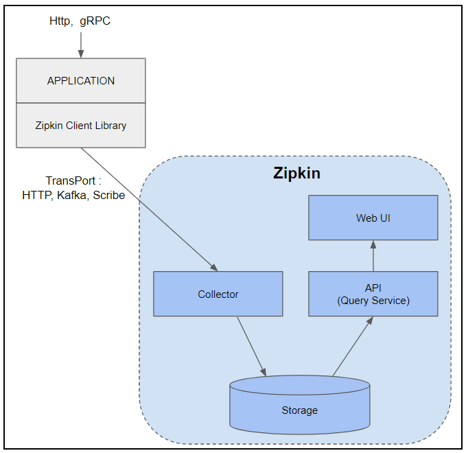
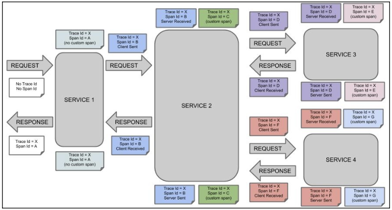

# Zipkin

> MSA 환경의 단점

MSA 환경은 여러 서비스들이 서로 네트워크를 통해 소통하며 요청을 처리해나갑니다.
서비스 간 소통을 위한 네트워크 통신으로 인해 에러 트레이싱이 어려워진다는 것이 MSA의 단점입니다.
하지만, 우리는 OpenTracing을 통해 이를 도움받을 수 있습니다.

> OpenTracing이란?

OpenTracing은 분산 추적을 위한 벤더 중립적인 오픈 스탠다드로 개발자들이 어떤 분산 추적 시스템이든 관계없이 애플리케이션에 추적 수집과 조회를 일관된 방식으로 통합할 수 있게 하는 API를 제공합니다.
(마치 JPA가 표준이고, Hibernate가 그의 구현체인 것처럼)

> Zipkin이란?

Zipkin은 OpenTracing의 구현체로, MSA 환경에서 네트워크 Latency 문제들을 해결하기 위해 필요한 시간 순서의 데이터를 모으는 분산 추적 시스템입니다.

Zipkin을 통해 시스템의 Latency 문제와 여러 시스템 간의 네트워크 송수신으로 이루어지는 분산 시스템의 동작을 조금 더 쉽게 추적하고 문제를 효과적으로 해결할 수 있습니다.

> Zipkin의 구성 요소



1. Collector

Collector는 다양한 서비스로부터 Trace 데이터를 수신하는 역할을 합니다.
데이터는 HTTP, Kafka 등의 여러 방식으로 전송될 수 있으며,
Collector는 이 데이터를 처리하여 유효성 검사, 저장, 인덱싱 등의 작업을 수행하며, 이를 검색 가능하게 만들어줍니다.

2. Storage

Zipkin은 trace 데이터를 여러 저장소에 저장할 수 있도록 지원합니다.
(참고, Zipkin은 초기부터 Cassandra를 사용하여 데이터를 저장하는 것으로 만들어졌습니다.)
인메모리 환경, 관계형 DB, NoSQL 등을 사용 가능합니다.

- In-Memory 환경의 경우 간단한 로컬 테스트에 사용
- 관계형 DB(ex. MySQL)의 경우 소규모 환경에서 사용
- NoSQL의 경우 Cassandra / ElasticSearch 를 상용 운영 환경에서 사용

3. Query Service

Zipkin은 저장된 Trace 데이터를 다룰 수 있도록 API를 제공합니다.

4. Web UI

사용자는 서비스 이름, Span ID, 시간 범위 등의 여러 기준으로 Trace를 검색할 수 있습니다.

> Zipkin의 작동 방식



우리의 분산 시스템에 Zipkin을 추가한다면, Zipkin은 각 서비스에서 각 작업에 대한 시간 순서의 데이터를 캡처하며, 단일 클라이언트 요청과 관련된 모든 작업을 연결하기 위해 Trace ID 및 Span ID를 생성합니다.

- Trace : 시스템을 통해 흐르는 하나의 요청을 나타냅니다.
  - Trace ID : 위 Trace에 부여되는 각각의 ID
- Span : Trace 내의 개별 작업을 말합니다. 시작 및 종료 타임스탬프와 Annotations, Tags와 같이 작업에 대한 맥락을 제공하는 메타데이터가 포함되어있습니다.
  - Span ID : 위 Span에 부여되는 각각의 ID

하나의 요청이 다른 시스템으로 이동되면 만들어진 Trace ID와 Span ID를 함께 전달합니다.
Trace ID와 Span ID의 전달은 HTTP 헤더를 통해 이루어집니다. (아래에서 더 설명할 예정)
요청을 처리하는 각 서비스는 자신의 Span을 Trace에 추가하여 Zipkin이 서비스 간의 요청 경로 전체를 재구성할 수 있도록 합니다.
또한, Zipkin은 사용자에게 응답을 제공한 후 **비동기적**으로 추적에 대한 정보를 수집합니다.

> Zipkin의 HTTP 헤더를 통한 추적 정보 전달 방식

```java
   Client Tracer                                                  Server Tracer
┌───────────────────────┐                                       ┌───────────────────────┐
│                       │                                       │                       │
│   TraceContext        │          Http Request Headers         │   TraceContext        │
│ ┌───────────────────┐ │         ┌───────────────────┐         │ ┌───────────────────┐ │
│ │ TraceId           │ │         │ X-B3-TraceId      │         │ │ TraceId           │ │
│ │                   │ │         │                   │         │ │                   │ │
│ │ ParentSpanId      │ │ Inject  │ X-B3-ParentSpanId │ Extract │ │ ParentSpanId      │ │
│ │                   ├─┼────────>│                   ├─────────┼>│                   │ │
│ │ SpanId            │ │         │ X-B3-SpanId       │         │ │ SpanId            │ │
│ │                   │ │         │                   │         │ │                   │ │
│ │ Sampling decision │ │         │ X-B3-Sampled      │         │ │ Sampling decision │ │
│ └───────────────────┘ │         └───────────────────┘         │ └───────────────────┘ │
│                       │                                       │                       │
└───────────────────────┘                                       └───────────────────────┘
```

Zipkin은 B3-Propagation을 사용합니다. `X-B3-` 으로 명칭하는 HTTP 헤더를 통해 4개 값을 전달하고, 이 4개의 값을 통해 추적 정보를 관리합니다.

- TraceId : 64 또는 128비트이며 하나의 추적에 대한 고유한 ID, 모든 Span은 동일한 TraceId를 공유
  - TraceId의 HTTP 헤더 Key : X-B3-TraceId
- SpanId : 64비트, 추적 트리에서 현재 명령에 대한 포지션을 가리킴
  - SpanId의 HTTP 헤더 Key : X-B3-SpanId
- ParentSpanId : 64비트, 추적 트리에서 부모 명령에 대한 포지션을 가리킴, 루트라면 이 항목을 가지고 있지 않음
  - ParentSpanId의 HTTP 헤더 Key : X-B3-ParentSpanId

위 3개를 제외한 Sampling decision에 대해 이해하기 위해서는 Sampling State에 대해 먼저 아는 것이 좋습니다.

Zipkin에서는 모든 요청을 전부 추적하는 것이 아닌 일부 요청만 샘플링하여 추적할 수 있습니다.
Sampling State에는 4가지 유효한 상태가 존재합니다.

- Defer : 아직 결정하지 못한 상태
  - 샘플링을 하지 않고 있는 상태를 의미
- Deny : 샘플링을 하지 않거나 기록하지 않는 상태
  - 확률적으로 샘플링이 되지 않거나 특정 요청에 대한 Trace가 생성하는 것을 방지하기 위해 사용
- Accept : 샘플링하거나 기록하는 상태
  - 확률적으로 샘플링이 되거나 특정 요청이 항상 추적되도록 하는데 사용
  - Accept 상태라면 과부하 상황을 제외하고는 Span이 Zipkin에 전달되어야 함
- Debug : 강제로 추적하는 상태
  - Debug는 프로덕션의 트러블슈팅 목적으로 사용
  - 강조된 Accept 상태로, Trace의 각 Span에 대해서 Span.debug = true로 보고됨

Sampling State의 HTTP 헤더 Key

- X-B3-Sampled : 1 → Accept
- X-B3-Sampled : 0 → Deny
- 해당 Key가 존재하지 않는 경우 : Defer
- X-B3-Flags : 1 → Debug

> 주의할 점

하지만, 이런 좋은 Zipkin도 고려해야 할 점이 존재합니다!
서비스의 요청들을 추적하고 이를 데이터를 남기는 작업은 결국 추가적인 오버헤드가 발생하게 됩니다.
애플리케이션이 많은 양의 트래픽을 처리하는 경우 높은 샘플링 비율을 사용한다면

- 데이터베이스에 부하가 생기거나,
- Trace 데이터를 생성하고, 처리, 전송하는 작업을 위한 서버 리소스가 더 사용되며,
- 높은 비율로 샘플링하므로 더 많은 데이터를 전송하게 되어 네트워크에도 부하가 생길 수 있으며 이는 네트워크 지연으로 이어질 수 있습니다.

샘플링의 비율은 0.0~1.0 (0% ~ 100%)로 기본적으로는 0.1로 세팅되어있습니다.
따라서, 시스템의 요구사항과 목표에 맞게 어느정도의 데이터를 샘플링할 것인지도 중요합니다.
초기에는 보수적인 접근으로 시스템 영향도를 낮추고, 필요에 따라 조정하는 것도 좋은 방법일 것 같습니다.

- [ ] Sampling State 내용 추가 필요
- [ ] Spring Cloud Sleuth와 Spring Boot 3에서 Micrometer..
